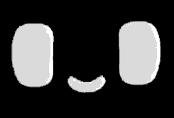
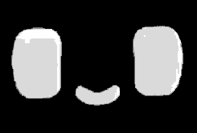
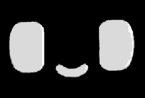
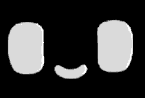
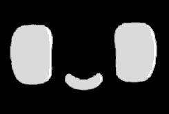
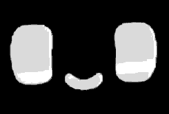
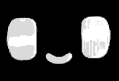

# Watcher Mochi

|                                |                                    |                                |                                  |                                        |
| :----------------------------: | :--------------------------------: | :----------------------------: | :------------------------------: | :------------------------------------: |
|  |  |    |  |  |
|             happy              |              dancing               |              love              |              sleepy              |               surprised                |
|  |  |  |      |            |
|             devil              |              sparkle               |             sushi              |               rain               |                  wink                  |

Build your own [Dasai Mochi](https://dasai.co) with [SenseCAP Watcher](https://www.seeedstudio.com/SenseCAP-Watcher-W1-A-p-5979.html).

## What You Need

- SenseCap Watcher: [Buy here - 99$ - Coupon: 5EB420ZS](https://www.seeedstudio.com/SenseCAP-Watcher-W1-A-p-5979.html?sensecap_affiliate=3gToNR2&referring_service=link)
- A microSD card (any size, FAT32 formatted)
- A USB-C cable
- A computer with [ESP-IDF](https://docs.espressif.com/projects/esp-idf/en/stable/esp32s3/get-started/) v5.4+ installed

If you want to buy a SenseCap Watcher, consider buying with the link or coupon above. It's an affiliate link so I'll get a small percentage of your order as appreciation ^^

## Step 1: Prepare the SD Card

1. Format your microSD card as **FAT32**
2. Copy all the `.gif` files from the `sd_content/` folder in this repo onto the root of the SD card
3. Insert the SD card into your Watcher

I've included 63 animations plus a `blank.gif` that shows between animations. You can add your own GIFs too - just drop any `.gif` file onto the root of the SD card.

## Step 2: Install ESP-IDF

If you don't have ESP-IDF set up yet, follow the [official getting started guide](https://docs.espressif.com/projects/esp-idf/en/stable/esp32s3/get-started/) for your platform (Windows, macOS, or Linux). Make sure you install **v5.4 or newer**.

## Step 3: Build and Flash

1. Connect your Watcher to your computer via USB-C
2. Open a terminal in this project folder
3. Run:

```sh
idf.py build
idf.py flash monitor
```

`flash` uploads the firmware to your Watcher. `monitor` shows the serial log so you can see what's happening. Press `Ctrl+]` to exit the monitor.

## How It Works

- **Tap the screen** to play a random animation with a pop sound
- **Wait 30 seconds** and it auto-plays a random animation on its own
- **Leave it alone for 5 minutes** and it enters deep sleep to save power
- **Long-press the button** to manually enter deep sleep
- **Press the button** to wake it back up

## Configuration

You can tweak settings like the sleep timeout and auto-play interval through `idf.py menuconfig` under the **Mochi** menu. Defaults are in `sdkconfig.defaults`.

## License

The firmware source code is licensed under the [Apache License 2.0](LICENSE).

The GIF animations in `sd_content/` are property of [Dasai](https://dasai.co) and are included here for personal use with the Watcher Mochi project. All rights to the animations belong to Dasai.
