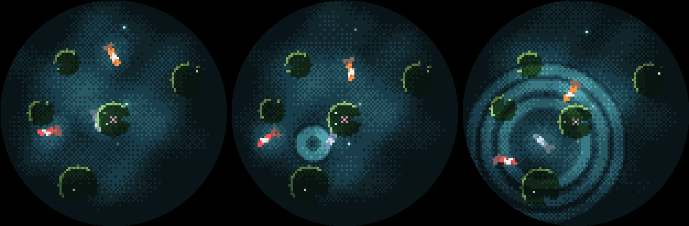
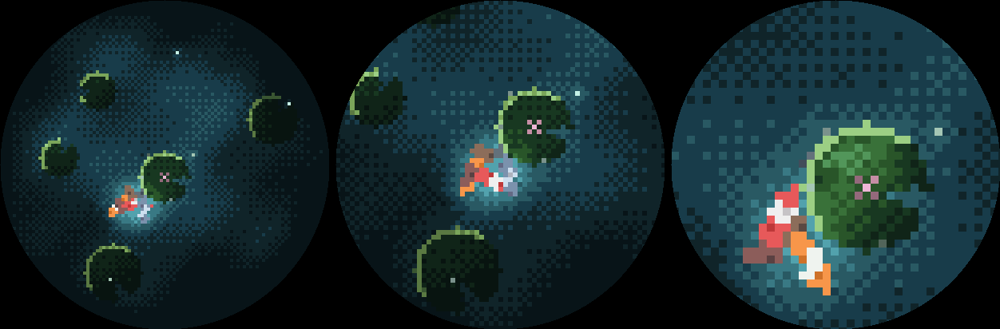

# Watcher Mochi



A tiny pixel koi pond for the [SenseCAP Watcher](https://www.seeedstudio.com/SenseCAP-Watcher-W1-A-p-5979.html). Dark water, glowing rings, koi that come over when you tap the glass.

## What You Need

- SenseCap Watcher: [Buy here - 69$ - Coupon: 5EB420ZS](https://www.seeedstudio.com/SenseCAP-Watcher-W1-A-p-5979.html?sensecap_affiliate=3gToNR2&referring_service=link)
- A USB-C cable
- A computer with [ESP-IDF](https://docs.espressif.com/projects/esp-idf/en/stable/esp32s3/get-started/) v5.4+ installed

No SD card needed — the pond is drawn on the device, nothing is loaded from storage.

❤️ **If you want to buy a SenseCap Watcher, consider buying with the link or coupon above**. It's an affiliate link so I'll get a small percentage of your order as appreciation ^^

## Step 1: Install ESP-IDF

If you don't have ESP-IDF set up yet, follow the [official getting started guide](https://docs.espressif.com/projects/esp-idf/en/stable/esp32s3/get-started/) for your platform (Windows, macOS, or Linux). Make sure you install **v5.4 or newer**.

## Step 2: Build and Flash

1. Connect your Watcher to your computer via USB-C
2. Open a terminal in this project folder
3. Run:

```sh
idf.py build
idf.py flash monitor
```

`flash` uploads the firmware to your Watcher. `monitor` shows the serial log so you can see what's happening. Press `Ctrl+]` to exit the monitor.

## How It Works

- **Tap the screen** to drop a ripple with a wet plop. Rings spread out from your finger and the koi swim over to see what fell in
- **Turn the knob** to zoom. Wide open you see the whole pond; closer in the camera picks a koi and drifts after it
- **Watch it** and the koi wander on their own, the lily pads bob, one of the fish noses the surface every now and then, and something falls in over by the far bank
- **Leave it alone for 5 minutes** and it enters deep sleep to save power
- **Long-press the button** to manually enter deep sleep
- **Press the button** to wake it back up

The lily pads are scattered randomly on every boot, so no two ponds look the same.



## How It's Drawn

Everything lives in [`main/pond.c`](main/pond.c). There are no image assets — the pond is a small simulation rendered fresh every frame:

- The pond is a fixed **103×103 world** of world pixels, and the screen is a camera window into it. Each world pixel is drawn as a block of screen pixels, so the zoom level sets both how much of the pond you can see and how chunky it looks. Wide open, one world pixel is 4 screen pixels and the whole pond fits the 412×412 panel.
- Each visible cell holds a **material** (water, lily pad, koi body, ...) and a **light level**. Colour is only resolved at the end, by looking each material up in its own dark-to-lit ramp, so anything that glows just adds light and the whole scene stays consistent.
- Light falls off towards the rim, which is what makes the pond read as a pool in the dark rather than a flat background. A 4×4 **ordered dither** breaks up the banding between light levels.
- A tap spawns three staggered rings. Each ring adds light where `(d² − r²) / 2r` — a cheap stand-in for the distance to the ring — lands near zero, and takes a little away just behind it for the trough.
- Koi are an 11×7 sprite sampled in body space, so they rotate with their heading and flick their tail as they swim.
- Zoomed in, the camera aims slightly ahead of one koi and eases towards it, which cancels out the lag and keeps it framed. A koi that swims under a lily pad still glows faintly through the leaf, so it never disappears on you.

All of it is fixed-point integer maths on a 256-entry sine table, which keeps a frame at a few milliseconds and leaves the CPU mostly idle.

## How It Sounds

There are no audio assets either. Every sound in [`main/sound.c`](main/sound.c) is one sine oscillator whose pitch glides **upwards** while its amplitude decays — that rising chirp is what makes a droplet read as a droplet, because the bubble the drop leaves behind shrinks and its resonance climbs. The starting pitch and decay are randomised per hit, so a pond full of them never sounds mechanical.

There are four voices: the tap plop, a softer lower one when a koi noses the surface, a quiet far-off drop with a long tail, and a dry little tick for each knob detent. They are mixed in one task and fed through two damped feedback combs — just enough reverb to put the pond in a dark room — then through a `tanh` soft limiter so several drops at once bend rather than clip.

The audio task only streams while something is sounding, so silence costs nothing.

## Configuration

You can tweak the sleep timeout, the number of koi, lily pads, and drifting motes through `idf.py menuconfig` under the **Mochi** menu. Defaults are in `sdkconfig.defaults`.

## License

The firmware source code is licensed under the [Apache License 2.0](LICENSE).
