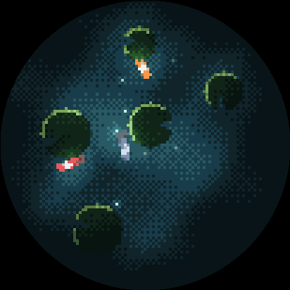
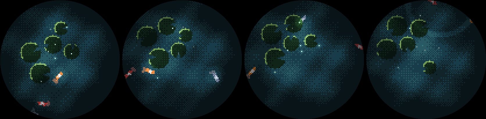

# Watcher Mochi

<p align="center">
  
</p>

A pixel koi pond for the [SenseCAP Watcher](https://www.seeedstudio.com/SenseCAP-Watcher-W1-A-p-5979.html). Dark water, glowing rings, koi that come over when you tap the glass.

Nothing is loaded from storage. There are no image assets and no audio assets — every frame is simulated and every sound is synthesised, so the firmware is the whole thing.

## What You Need

- SenseCap Watcher: [Buy here - 69$ - Coupon: 5EB420ZS](https://www.seeedstudio.com/SenseCAP-Watcher-W1-A-p-5979.html?sensecap_affiliate=3gToNR2&referring_service=link)
- A USB-C cable
- A computer with [ESP-IDF](https://docs.espressif.com/projects/esp-idf/en/stable/esp32s3/get-started/) v5.4+ installed

No SD card needed.

❤️ **If you want to buy a SenseCap Watcher, consider buying with the link or coupon above**. It's an affiliate link so I'll get a small percentage of your order as appreciation ^^

## Build and Flash

Install [ESP-IDF](https://docs.espressif.com/projects/esp-idf/en/stable/esp32s3/get-started/) v5.4 or newer for your platform, connect the Watcher over USB-C, then from this folder:

```sh
idf.py build
idf.py flash monitor
```

`flash` uploads the firmware, `monitor` shows the serial log. `Ctrl+]` exits the monitor.

## Controls

| | |
| --- | --- |
| **Tap the screen** | A ripple lands where your finger did, with a wet plop. Three rings spread out and every koi swims over to see what fell in. |
| **Turn the knob** | Zoom, six steps. Wide open you get the whole pond; closer in the camera picks a koi and drifts after it. |
| **Press the button** | Wakes it from sleep. |
| **Long-press the button** | Straight to deep sleep. |
| **Do nothing for 5 minutes** | Deep sleep on its own. |

Left alone it keeps going: the koi wander, the lily pads drift, one of the fish noses the surface every so often, and every now and then something falls in over by the far bank.

## Zoom

<p align="center">
  
</p>

The same instant at three of the six detents. The pond is a fixed world and the screen is a camera window into it, so zooming changes how many screen pixels one world pixel gets — you see less of the pond, and what you do see is chunkier. Past the widest step the camera latches onto a koi and follows it, aiming a little ahead so the easing lag cancels out. A koi that swims under a lily pad glows through the leaf rather than disappearing (visible on the left pad in the last shot).

## A Pond That Moves

<p align="center">
  
</p>

The same pond, roughly forty seconds apart each time. Three koi and five lily pads are being simulated in every one of those frames — but the koi roam past the rim and the pads drift, and everything dims with distance from the middle, so the number you can actually *count* moves around. Sometimes five pads, sometimes four; sometimes three fish, sometimes one and a faint shape at the edge.

Counts are a runtime number, not a compile-time one:

```c
void pond_set_population(int koi, int pads, int motes);
void pond_get_population(int *koi, int *pads, int *motes);
```

Left to itself a drifting leaf is a 2D random walk, and a random walk spends most of its time far from where it started — the first version of this had every lily pad stranded against the rim within two minutes. So pads are free in the middle two-thirds of the pond and steered back harder the further out they get, and they nudge each other apart so they crowd without stacking.

## How It's Drawn

Everything lives in [`main/pond.c`](main/pond.c). The pond is a fixed **103×103 world** of world pixels — a quarter of the 412×412 panel at the widest zoom, which is where the chunky pixels come from. Each visible cell carries two things, a **material** and a **light level**, and colour only happens at the very end:

```
per frame, into two buffers the size of the visible window:

  water            ambient light: radial falloff, crossing swells
  + koi glow       halo, added to open water only
  + ripples        crest and trough, added to open water only
  + koi bodies     material + its own light
  + lily pads      material, dimming whatever was under it
  + underglow      a koi showing through a leaf
  + motes          material + halo
        │
        ▼
  blit             colour = ramp[material][ (light + dither) → 0..5 ]
        │
        ▼
  canvas           each cell painted as an s_pix × s_pix block
```

Because everything that glows just *adds light*, the koi, the rings and the motes all sit in one lighting model instead of being three special cases. Light falls off towards the rim, which is what makes the pond read as a pool in the dark rather than a flat background, and a 4×4 [ordered dither](https://en.wikipedia.org/wiki/Ordered_dithering) breaks up the banding between the six levels.

Some details worth knowing:

- A tap spawns three staggered rings. Each adds light where `(d² − r²) / 2r` — a cheap stand-in for the distance to the ring — lands near zero, and takes a little away just behind it for the trough. No `sqrt` in the inner loop.
- Koi are an 11×7 sprite sampled in *body* space, so they rotate with their heading for free. The tail flick is capped at one pixel; at two it tears away from the body.
- Lily pads are a circle with a wedge notch, drawn as a dark silhouette with a lit rim on the side facing the light.

All of it is fixed-point integer maths on a 256-entry sine table. A frame costs a few milliseconds at 25 fps and leaves the CPU mostly idle.

## How It Sounds

Every sound in [`main/sound.c`](main/sound.c) is synthesised, from the physics of what actually makes the noise.

The plop of something hitting water is not the drop. Phillips, Agarwal and Jordan filmed it with high-speed cameras and found the sound is driven by a small **air bubble trapped under the surface**: the impact makes a brief click, the crater takes a few milliseconds to form, then the entrapped bubble rings and drives the water surface like a piston ([Scientific Reports, 2018](https://www.nature.com/articles/s41598-018-27913-0)). Each voice here is that same three-part event — a filtered noise click, a short gap, then a decaying sine.

Two results give the rest for free:

- **[Minnaert's 1933 result](https://en.wikipedia.org/wiki/Minnaert_resonance)**, that a bubble in water resonates at `f₀ · r ≈ 3.26 Hz·m`. So voices are specified by *bubble radius*, not frequency, and the pitch falls out of the physics. A fingertip-sized pocket of air (3–4 mm) rings around 800–1000 Hz.
- **[Van den Doel's liquid sound model](https://dl.acm.org/doi/10.1145/1101530.1101554)** (ACM TAP, 2005), where the pitch rises as the bubble rings: `f(t) = f₀ · (1 + ξ · d · t)` against an `e^(−d·t)` decay, with `ξ ≈ 0.1` found experimentally. That rise is the part your ear reads as *water*, and it costs one add per sample.

Four voices — the tap plop, a softer lower one when a koi noses the surface, a quiet far-off drop with a long tail, and a dry noise tick for each knob detent. They mix in one task through two damped feedback combs, just enough reverb to put the pond in a dark room, then a `tanh` soft limiter so several drops at once bend rather than clip. Bubble radius and decay are randomised per hit, so no two plops are the same.

For the record, a real dripping tap traps a bubble ten times smaller and plinks up near 9 kHz — above the Nyquist limit of this 16 kHz codec, and well past what its little speaker could move. Bigger, lower bubbles are both the right sound for a pond and the only one this hardware can make.

The audio task only streams while something is sounding, so silence costs nothing.

## Configuration

`idf.py menuconfig`, under the **Mochi** menu:

| Option | Default | |
| --- | --- | --- |
| `MOCHI_DEEP_SLEEP_TIMEOUT_SEC` | 300 | Idle seconds before deep sleep |
| `MOCHI_POND_KOI_COUNT` | 3 | Koi simulated (max 8) |
| `MOCHI_POND_LILY_COUNT` | 5 | Lily pads simulated (max 12) |
| `MOCHI_POND_MOTE_COUNT` | 7 | Drifting motes (max 16) |

These are starting values — `pond_set_population()` changes any of them at runtime. Defaults are in `sdkconfig.defaults`.

## License

The firmware source code is licensed under the [Apache License 2.0](LICENSE).
